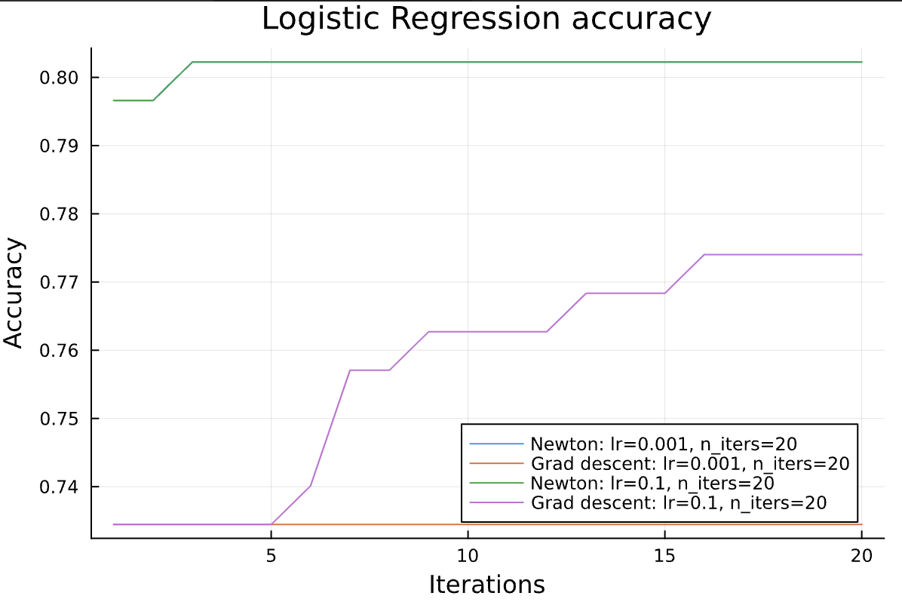
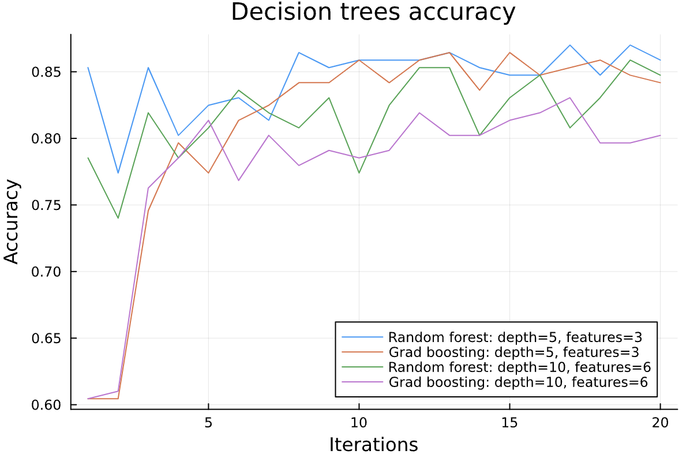

# Survival prediction in Titanic

This project focuses on predicting passenger survival using machine learning models. The [Titanic dataset](https://www.kaggle.com/c/titanic) was used for this analysis. 

## Preprocessing
To ensure accurate model training, missing values in the dataset were carefully handled through deletion or imputation based on their proportion and significance.
After analysis of the data, it was decided to:
- delete row: Embarked (0.2% missing), Fare(0.2% missing)
- delete column: Cabin (77.1-78.2% missing), Ticket (not important)
- imputate with KNN: Age (19.9-20.6% missing)

Imputation was done using KNN algorithm from Impute module.

### New Features

To enhance the prediction accuracy, several new features were engineered from the existing data:
- **FamilySize**: Created by combining the SibSp and Parch columns.
- **IsAlone**: A binary feature indicating if a passenger is traveling alone.
- **Title**: Extracted from the Name column to capture social status.

These new features were added to the dataset using the functions defined in [src/NewFeatures.jl](src/NewFeatures.jl).

## Prediction methods

### Logistic regression
A logistic regression model was implemented to provide a baseline for comparison with more complex models.
Two methods for logistic regression were used, Newton and Gradient descent. In the graph, it can be seen that Newton performs slightly better.



### Decision trees
Two decision trees models were chosen for the project:
- Random forest: constructs multiple trees independetly on a randomly selected subset of training data and features
- Gradient boosting trees: builds trees sequentially by training each new tree on residual errors made by previous trees

Both build and combine decision trees using Gini impurity as the criterion. According to this [article](https://quantdare.com/decision-trees-gini-vs-entropy/), Gini impurity has a shorter training time compared to entropy, making it a more efficient choice for this project.



## Instalation
To install the survival prediction package, use the following command in the Julia REPL in project environemt:
```julia
add https://github.com/B0B36JUL-FinalProjects-2024/Project_sidlodo1.git
```

## Usage

Example usage in `examples/examples.jl`:
```julia
include("../src/SurvivalPrediction.jl")
using .SurvivalPrediction
SP = SurvivalPrediction
# prepare data

path = joinpath(@__DIR__, "../data/train.csv") |> normpath
X_trn, y_trn, X_tst, y_tst = SP.Utils.load_data_and_split(path; test_ratio=0.2)

# run models
model_LR = SP.LR.LogRegModel(n_iters=100)

method_grad = SP.LR.GradientDescentMethod()
pred = SP.get_prediction(model_LR, method_grad, X_trn, y_trn, X_tst)
accuracy = SP.Utils.classify_predictions(pred, y_tst)

method_new = SP.LR.NewtonMethod()
SP.report_classification(model_LR, method_new, X_trn, y_trn, X_tst, y_tst)

...
```
